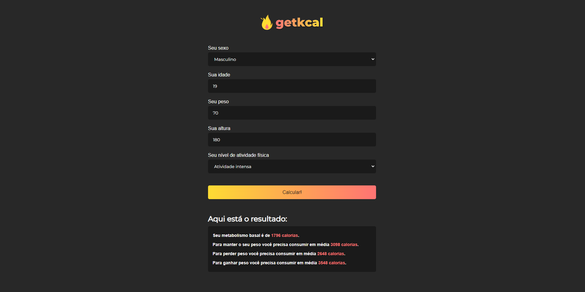

</br>


       
<p>PROJETO EM JAVASCRIPT</p>
<hr>
</br>
    <p aling="center"> 🔥 GetKcal é um sistema que se preocupa em avaliar seu físico e te auxiliar em seu bem estar, te ajudando a ganhar, perder ou manter seu peso! </p>
    <ul>
        <li>Projeto retirado de aula para estudo </li>
    </ul>
</br>
       

    
</br>

### 🎲 Rodando o Front 

```bash

    # Clone este repositório  
    $ git clone <https://github.com/KayoSilva19/GetKcal-CalculandoCalorias.git>

    # Acesse a pasta do projeto no terminal/cmd
    $ cd Projeto-GetKcal


```
